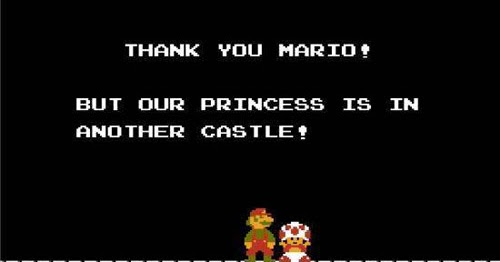

#### [return to demo-01](directions-demo-01.md)
# Directions for Bitbucket 

No `git clone` needed. Why? Because you're not creating files locally, there's no need to have the
local-repository-remote-repository relationship. Since we are working completely within the website GUI,
we haven't technically met our goal of having a local copy of the repository.

In the next demo, we'll work on creating our own copy of the respository which can be done within
the Bitbucket website GUI.

#### [return to demo-01](directions-demo-01.md)
#### [proceed to demo-02](../demo_02/directions-demo-02.md)