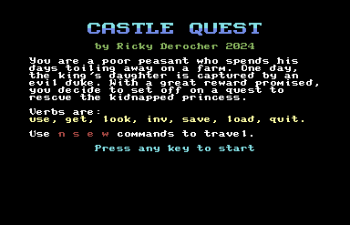
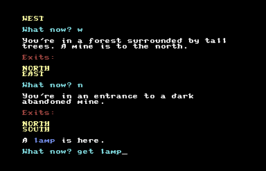

#### [return to demo-01](../demo_01/directions-demo-01.md)
# A Plethora of Git, Level 2

We now have a local copy of the repository on our workstation in most of these pathways.

## Choose Your Own Adventure
As always, while you can take an *all of the above* approach to see which style might suit you best, feel free
to skip around to the pathway that you might be most comfortable with. The next step is to create a new `branch`
where we will be directly editing our work. This demo covers that process.

- [Directions for Bitbucket](Bitbucket.md)
- [Directions for Git for Windows](Git-for-Windows.md)
- [Directions for Atlassian Sourcetree](Sourcetree.md)
- [Directions for Visual Studio Code](VS-Code.md)

## The Goal
At the end of this demo you'll be able to create a new branch in the git training repository.

#### [return to demo-01](../demo_01/directions-demo-01.md)
#### [proceed to demo-03](../demo_03/directions-demo-03.md)