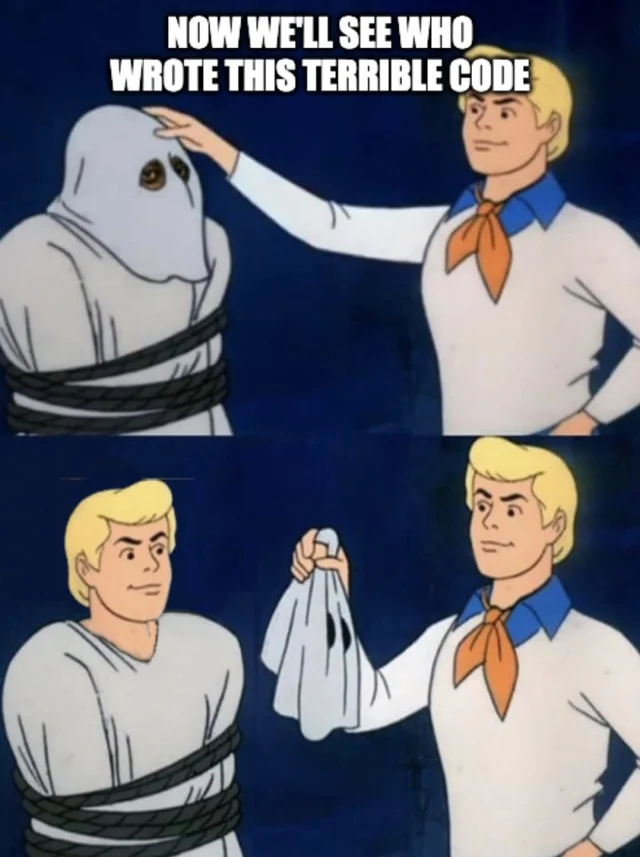

#### [return to demo-03](directions-demo-03.md)
# Directions for Bitbucket

From the Bitbucket repository webpage, you'll `switch` from `main` to your new `branch` that you created in the previous module. You can also get to your `branch` by directly entering it into the URL. Where the `main` repository looks like this:

- https://bitbucket.org/some-tenant/git-training/src/main

You'll change the last section of the URL to match your `branch` name:

- https://bitbucket.org/some-tenant/git-training/src/jcarmona-git-demo

Now that you are in your own `branch`, let's make a simple edit. Navigate to the `demo_03` directory.

We'll create a new text file:

- let's name it `guest-book.txt`
- on line 1
    - add a fun saying
    - sign your name
- click **commit** on the bottom right

A **Commit changes** pop-up will appear. There is a text box with the label, **Commit message**, and a checkbox asking if you'd like to make a `pull request`. 

> Let's talk about the commit message, like `branch` names, we haven't decided upon a set of
> standards yet. There is quite a lot to consider, there are many different opinions, consider
> the following:
> 
> - https://cbea.ms/git-commit/
> - https://www.freecodecamp.org/news/how-to-write-better-git-commit-messages/
> - https://arialdomartini.wordpress.com/2012/09/03/pre-emptive-commit-comments/
> - https://www.chiark.greenend.org.uk/~sgtatham/quasiblog/commit-messages/
>
> That said, imagine you open a Python script and it's just horrible. Really ragged. You're
> honestly embarrassed:
>
> 1. how bad it is 
> 2. you have to work on it
>
> Git blame shows you the original author of this code:
>
> - You.
>     - from six months ago
> {width=200px}
> 
> Now if you're asking yourself, literally, "why did you do this!?!" Your commit message
> might tell you everything you need to know. Or it might be useless.
> For now, it's up to you.

The Commit message box will be pre-populated like: *guest-book.txt created online with Bitbucket*

- write a commit message in the text box
- click **Commit**

**You have officially made your first commit!**

#### [return to demo-03](directions-demo-03.md)
#### [proceed to demo-04](../demo_04/directions-demo-04.md)

***

***

#### [return to demo-03](directions-demo-03.md)
#### [proceed to demo-04](../demo_04/directions-demo-04.md)