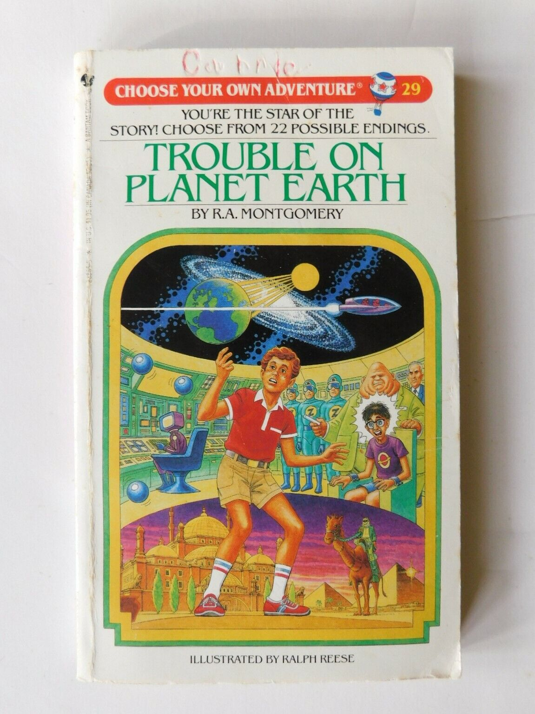
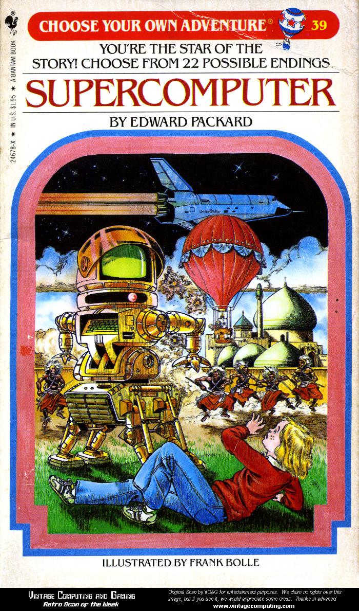

#### [return to demo-02](../demo_02/directions-demo-02.md)
# A Plethora of Git, Level 3

{width=400px}

We now have a unique `branch` based off of `main`.

## Choose Your Own Adventure
As always, while you can take an *all of the above* approach to see which style might suit you best, feel free
to skip around to the pathway that you might be most comfortable with.

- [Directions for Bitbucket](Bitbucket.md)
- [Directions for Git for Windows](Git-for-Windows.md)
- [Directions for Atlassian Sourcetree](Sourcetree.md)
- [Directions for Visual Studio Code](VS-Code.md)

## The Goal
At the end of this demo you will `commit` your first edit.

{width=400px}

#### [return to demo-02](../demo_02/directions-demo-02.md)
#### [proceed to demo-04](../demo_04/directions-demo-04.md)