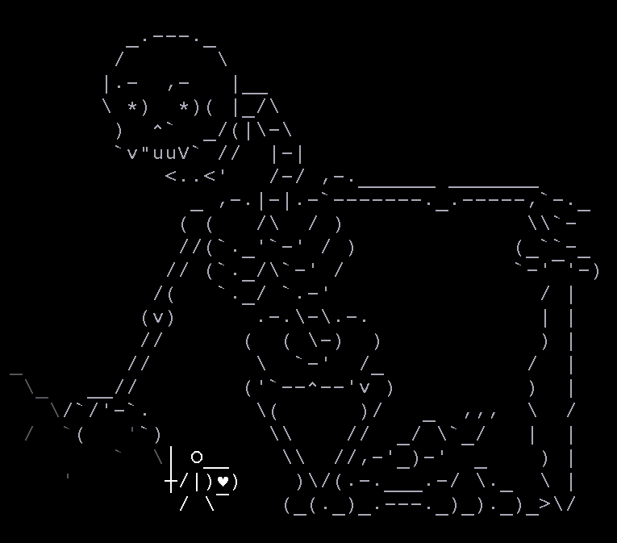
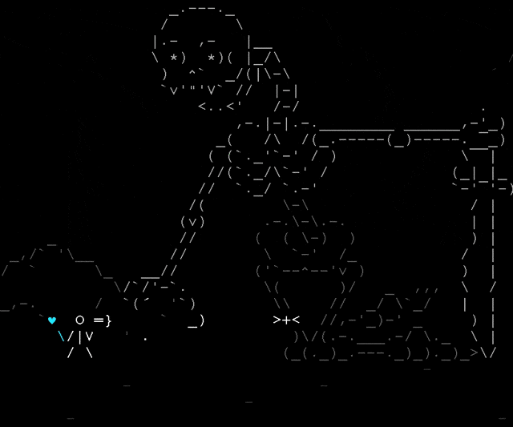

#### [return to demo-04](../demo_04/directions-demo-04.md)
# A Plethora of Git, Level 5

{width=400px}

We're nearing the end of our journey! Now that we have a local and remote respository, we are set up to do daily work.
In this pattern, you would `push` your daily changes to the remote repository while you are working on your specific
issue/task/fix. At the conclusion of that work, you would then `merge` your changes into main. The process that we have
for that is called a pull request.

## Cue Boss Battle Music
All our work across all of the various pathways has brought us to this singular point. The pull request.

## The Goal
At the end of this demo you will submit your first pull request.

🚪🚪[Enter if you dare.](pull-request.md)🚪🚪

{width=400px}

#### [return to demo-04](../demo_04/directions-demo-04.md)
#### [proceed to demo-06](../demo_06/directions-demo-06.md)