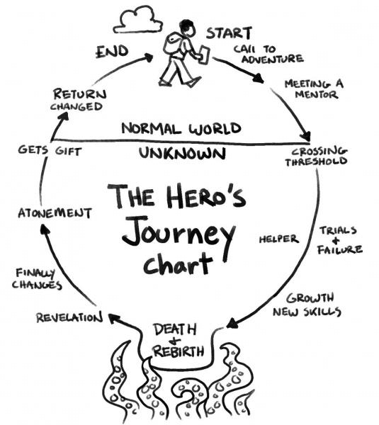
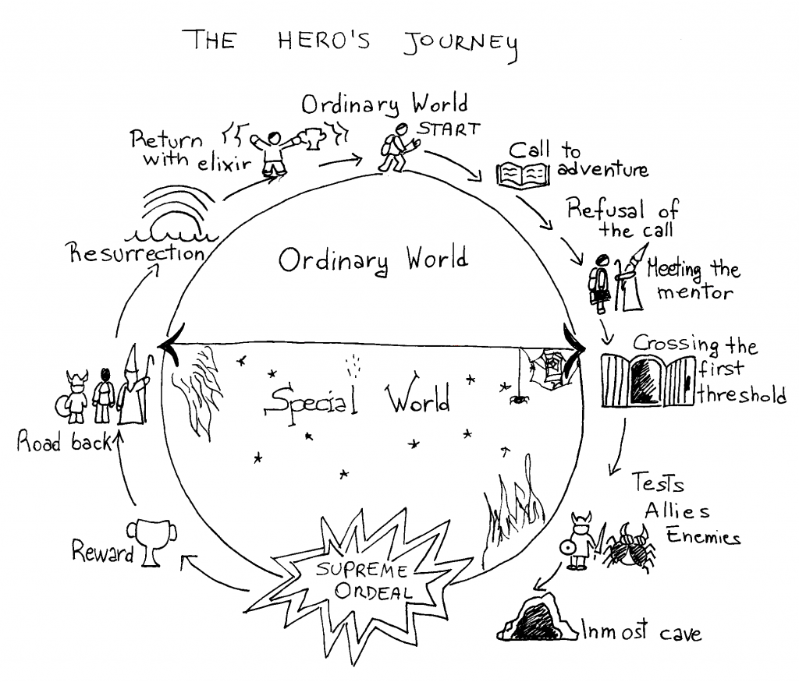

#### [return to demo-05](../demo_05/directions-demo-05.md)
# A Plethora of Git, Level 6

{width=400px}

You've slain the ~~boss~~, err, code. Now what? All that's left to do is tidy up your workspace. This
means removing branches that we don't need anymore. Let's put together everything that we learned
and demonstrate the end of the `branch` life cycle.

## Choose Your Own Adventure
As always, while you can take an *all of the above* approach to see which style might suit you best, feel free
to skip around to the pathway that you might be most comfortable with.

- [Directions for Bitbucket](Bitbucket.md)
- [Directions for Git for Windows](Git-for-Windows.md)
- [Directions for Atlassian Sourcetree](Sourcetree.md)
- [Directions for Visual Studio Code](VS-Code.md)

## The Goal
At the end of this demo you will delete a `branch` from the remote repository and then `prune` the corresponding
branch from your local respository.

{width=400px}

#### [return to demo-05](../demo_05/directions-demo-05.md)